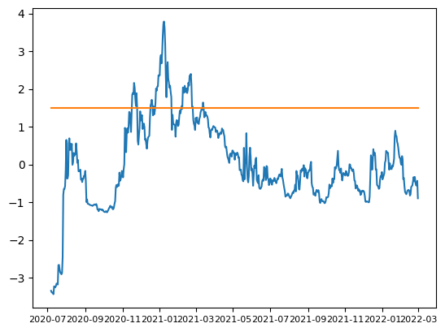
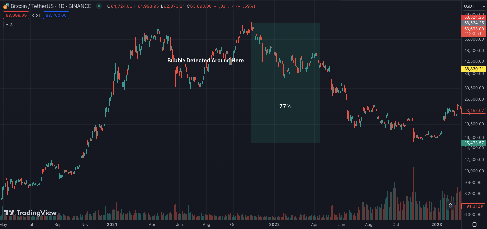

# Detecting-Bubbles-in-Stock-Market

This project explores the development of an algorithm leveraging the Augmented Dickey-Fuller (ADF) test to identify bubbles within financial time series.

### Backward Supremum Augmented Dickey-Fuller (BSADF) Test

The algorithm developed by Peter C. B. Phillips, Shu-Ping Shi, and Jun Yu is known for its application in detecting financial bubbles and periods of explosive behavior in time series data. The algorithm builds upon the traditional Augmented Dickey-Fuller (ADF) test for unit roots by incorporating a recursive right-tailed test procedure.

#### Key Concepts and Components

- **Augmented Dickey-Fuller (ADF) Test:**

    The ADF test is a statistical test used to determine whether a time series contains a unit root, implying non-stationarity. The test augments the basic Dickey-Fuller test by adding lagged difference terms to account for higher-order autoregressive processes.
- **Backward Supremum (BS) Approach:**

    The BSADF test extends the ADF test by considering multiple subsamples of the data, rather than a single sample. It involves recursively applying the ADF test to subsamples of the data to detect changes in the time series' properties over time.

- **Explosive Behavior Detection:**

    By analyzing the test statistics across these subsamples, the BSADF test can identify periods where the time series exhibits explosive behavior. This is particularly useful for detecting speculative bubbles in financial markets, where asset prices deviate significantly from their fundamental values.
- **Recursive Testing:**

    The recursive nature of the BSADF test allows for the identification of the starting and ending points of explosive periods. This is achieved by calculating the test statistics over a moving window of time, enhancing the ability to detect structural breaks and periods of non-stationarity.

#### Applications

 1) **Financial Bubbles**

    The BSADF test is widely used in financial economics to detect and date-stamp financial bubbles. By identifying periods of explosive growth in asset prices, researchers and practitioners can better understand the dynamics of market speculation and potential risks.

 2) **Economic Policy and Research**

    The test has applications beyond financial markets, including macroeconomic research and policy analysis. It helps in identifying periods of abnormal economic activity that might warrant intervention or further investigation.


This project employed the BSADF test to investigate the presence of bubbles in Bitcoin price data.



Following a potential bubble period, Bitcoin prices experienced a significant decline of approximately 77%



The BSADF test represents a significant advancement in time series econometrics, offering robust tools for detecting and analyzing explosive periods in economic and financial data.

[Related Article from Peter C. B. Phillips, Shu-Ping Shi, and Jun Yu](http://korora.econ.yale.edu/phillips/pubs/art/p1498.pdf)

### Environment


```BASH
pyenv local 3.11.3
python -m venv .venv
source .venv/bin/activate
pip install --upgrade pip
```